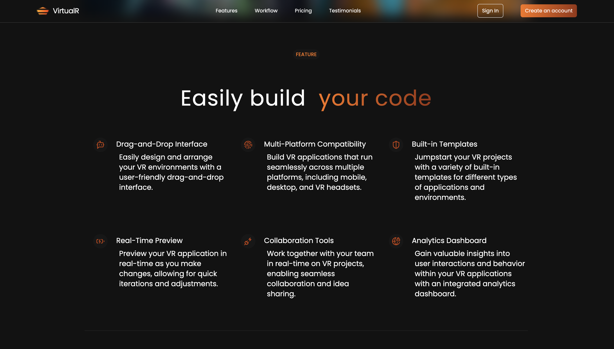
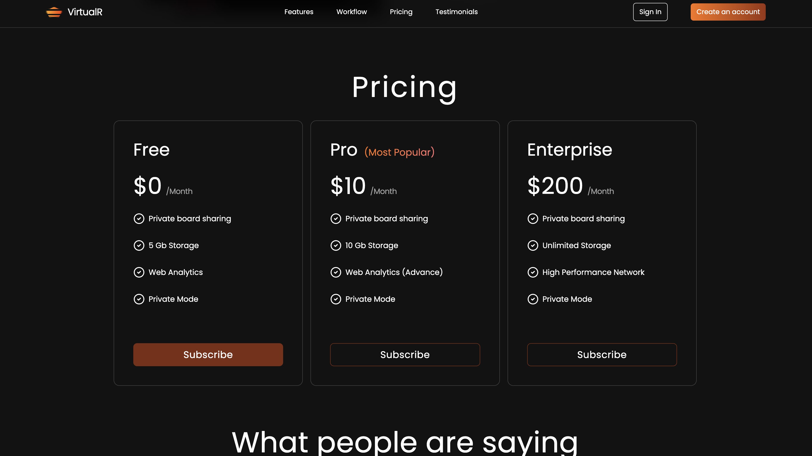
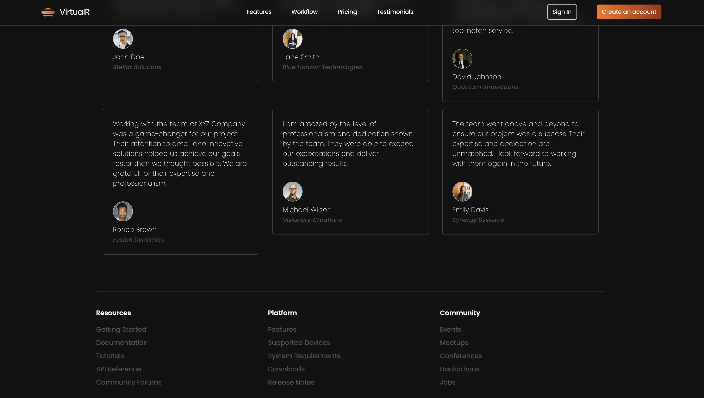

Jaguar Landing Page Clone

 

``React`` | ``Tailwind CSS`` | ``Vite``

 
<!-- OVERVIEW
 
 
This project is a clone of the official Jaguar website. 
It aims to replicate the design and functionality of the original website, providing users with a similar browsing experience.
 
 
FEATURES
 
 
Responsive Design: The website is designed to be fully responsive, ensuring a seamless experience across various devices and screen sizes.
 
 
Navigation Menu: Implements a navigation menu similar to the original website, allowing users to easily navigate between different sections.
 
 
Car Listings: Displays a range of Jaguar car listings with detailed information and images, mimicking the layout and styling of the original website.
 
 
Interactive Elements: Incorporates JavaScript to add interactive elements such as car image sliders, hover effects, and dropdown menus. -->

